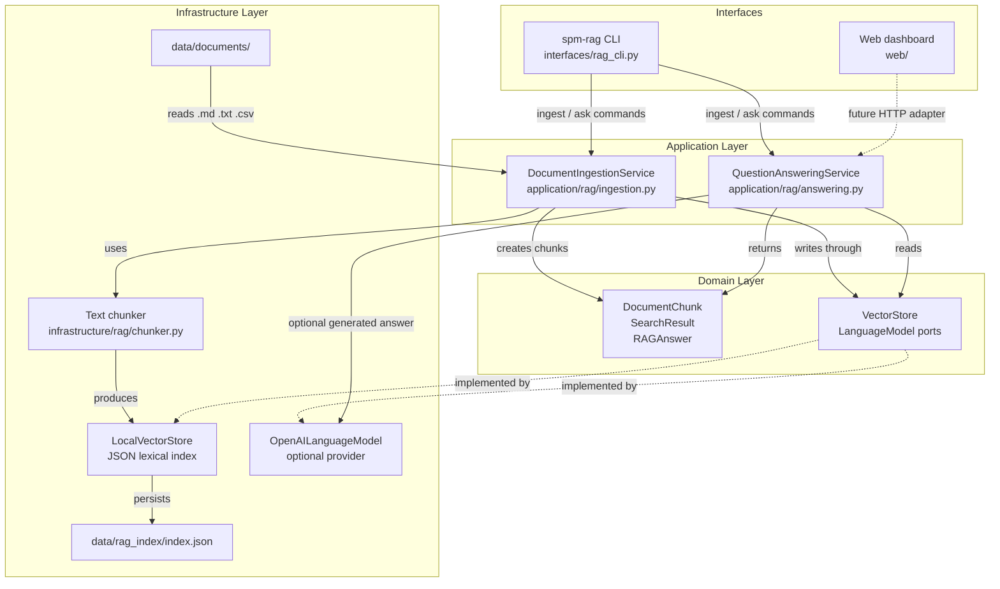

# RAG Architecture and Flow

This document describes the current local RAG implementation and the optional OpenAI generation path.

## 1. Architectural Diagram



### Boundary rules

- `domain/` contains plain Python models and no SDK, file, database, or network imports.
- `application/rag/` coordinates ingestion and answering use cases.
- `infrastructure/rag/` contains replaceable adapters.
- `interfaces/` parses user input and prints results.
- The default path uses `LocalVectorStore`; `--llm` explicitly enables the OpenAI adapter.

## 2. End-to-End Flow Diagram

```mermaid
flowchart LR
    subgraph Ingestion[Ingestion Flow]
        DOCS[Source documents\nMarkdown / TXT / CSV]
        READ[Read text]
        SPLIT[Split into overlapping chunks]
        RECORD[Create DocumentChunk records]
        SAVE[Save JSON index]

        DOCS -->|input path| READ
        READ -->|plain text| SPLIT
        SPLIT -->|chunk text + metadata| RECORD
        RECORD -->|upsert| SAVE
    end

    subgraph Retrieval[Question Flow]
        QUESTION[User question]
        TERMS[Extract lexical terms]
        SEARCH[Search indexed chunks]
        RANK[Rank by term overlap]
        CONTEXT[Top matching context]

        QUESTION -->|ask| TERMS
        TERMS -->|query| SEARCH
        SEARCH -->|candidate chunks| RANK
        RANK -->|top results| CONTEXT
    end

    subgraph Response[Response Flow]
        OFFLINE[Local grounded excerpts]
        PROMPT[Grounded prompt with sources]
        MODEL[OpenAI LLM]
        ANSWER[Answer with source paths]
        EMPTY[No supporting information]

        CONTEXT -->|default mode| OFFLINE
        CONTEXT -->|--llm| PROMPT
        PROMPT -->|HTTPS API request| MODEL
        MODEL -->|generated response| ANSWER
        CONTEXT -->|no matches| EMPTY
    end

    SAVE -.->|indexed data| SEARCH
    OFFLINE -->|response| ANSWER
```



## 3. Connector Meaning

| Connector | Meaning |
| --- | --- |
| Solid arrow `-->` | Direct runtime call or data transfer |
| Dashed arrow `-.->` | Replaceable boundary, future adapter, or persisted-data relationship |
| `-->|label|` | Direction of the call or data being passed |

## 4. Commands

```powershell
spm-rag ingest --input data/documents
spm-rag ask --question "Which parts require verified documentation?"
spm-rag ask --llm --question "Which parts require verified documentation?"
```

The third command requires `OPENAI_API_KEY`. Without `--llm`, the application remains local and deterministic.
